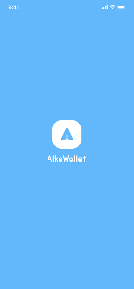

# Alke Wallet

Alke Wallet es una aplicación de billetera virtual desarrollada en Android Studio con Kotlin.
Permite a los usuarios gestionar sus transacciones financieras de manera conveniente y segura
directamente desde sus dispositivos móviles.

## Características

- **Splash Screen:** Una pantalla de bienvenida que aparece al iniciar la aplicación, proporcionando
  una experiencia visual agradable para los usuarios.
- **Login y Registro:** Páginas dedicadas para iniciar sesión o registrar una nueva cuenta.
- **Página de Inicio:** Interfaz principal donde los usuarios pueden ver su saldo y acceder a las
  funciones principales de la aplicación.
- **Página de Inicio - Caso Vacío:** En caso de que el usuario no tenga transacciones o fondos, se
  mostrará una interfaz limpia y amigable.
- **Solicitar Dinero:** Función que permite a los usuarios enviar solicitudes de pago a otros
  usuarios.
- **Enviar Dinero:** Función que permite a los usuarios enviar dinero a otros usuarios.
- **Perfil:** Página donde los usuarios pueden ver y editar su información personal.

## Estado Actual

En la versión actual, la aplicación solo muestra las vistas básicas y algunos botones para navegar
entre las páginas. Todas las funcionalidades están implementadas visualmente, pero no están
conectadas a una base de datos. Todos los datos se encuentran hardcodeados en la aplicación.

## Requisitos del Sistema

- Dispositivo Android con versión 5.0 (Lollipop) o superior.
- Conexión a internet para el registro y el inicio de sesión (aunque no se almacenen los datos).

## Instalación

1. Clona este repositorio en tu máquina local.
   [Alke Wallet Repositorio](https://github.com/krakerbrain/AndroidAlkeWallet.git)
2. Abre el proyecto en Android Studio.
3. Configura un emulador o conecta un dispositivo Android a tu máquina.
4. Ejecuta la aplicación en el emulador o dispositivo.

## Capturas de Pantalla

 |  | 

*Pantalla de bienvenida*

## Contribución

¡Las contribuciones son bienvenidas! Si deseas mejorar esta aplicación, por favor abre un issue
primero para discutir qué te gustaría cambiar.

## Autor

Esta aplicación fue desarrollada por [Mario Montenegro].

